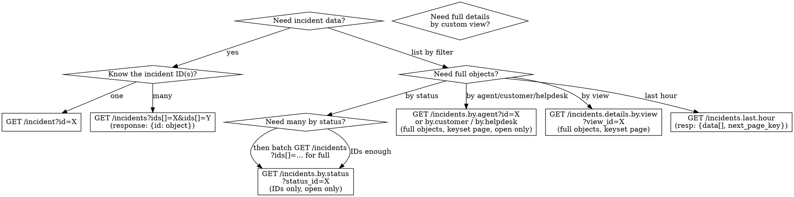

# InvGate API Requests

## Overview

The project calls InvGate's REST API v1 via `invgateGet<T>(endpoint)` at `INVGATE_BASE_URL/api/v1/`. Auth is Basic with `portalmda:API_KEY` (base64). All timestamps return epoch integers unless `?date_format=iso8601` is passed.

## Incident Query Strategy



**Note:** `by.agent`, `by.customer`, `by.helpdesk`, and `by.status` only return **open** requests. For closed/completed incidents, use `/incident?id=X` (if you know the ID) or build a saved view in InvGate and use `incidents.details.by.view`.

**Tip:** After getting IDs from `by.status` or `by.view`, batch-fetch full objects with `/incidents?ids[]=id1&ids[]=id2&...` instead of individual `/incident?id=X` calls.

## Endpoint Quick Reference

| Goal | Endpoint | Required params | Response shape |
|---|---|---|---|
| Connectivity | `sd.version` | — | `{version}` |
| Helpdesks | `helpdesks` | — | Array |
| Single incident | `incident` | `id` | Object |
| Incidents by IDs | `incidents` | `ids[]` (PHP array) | `{id: object}` — dictionary |
| Incidents by status | `incidents.by.status` | `status_id` or `status_ids[]` | `{requestIds[], total}` — IDs only |
| Incidents by agent | `incidents.by.agent` | `id` or `username` | `{requests: {id: object}, next_page_key}` |
| Incidents by customer | `incidents.by.customer` | `id` or `username` | `{requests: {id: object}, next_page_key}` |
| Incidents by helpdesk | `incidents.by.helpdesk` | `helpdesk_id` (not `id`) | `{requestIds[]}` — IDs only |
| Incidents by view | `incidents.by.view` | `view_id` | `{requestIds[]}` — IDs only |
| Incidents detail by view | `incidents.details.by.view` | `view_id` | `{data[], next_page_key}` |
| Last hour | `incidents.last.hour` | — | `{data[], next_page_key}` |
| Categories | `categories` | — | Array — offset page |
| Single user | `user` | `id` | Object |
| Users list | `users` | — | Array |
| Users search | `users.by` | any search field | `{data: {id: object}, next_page_key}` |
| KB articles | `kb.articles` | — | `{status, data[]}` — offset page |
| Incident comments | `incident.comment` | `request_id` (not `id`) | Array |
| Incident tasks | `incident.tasks` | `request_id` (not `id`) | Array |
| Incident links | `incident.link` | `request_id` | Array of `{id, title}` |
| Incident observers | `incident.observer` | `request_id` | Array of user IDs |
| Internal notes | `internalnotes` | `id` (not `request_id`) | Array |
| Time tracking | `timetracking` | `request_id` or `from`/`to` | Array |
| Attributes (.status, .priority, .type, .source) | `incident.attributes.*` | — | Array of `{id, name}` |

See `endpoints-reference.md` for full parameter and response details.

## Two Pagination Models

### Offset-based (`page` / `page_size`)
Used by: `categories`, `incidents.by.status`, `incidents.by.view`, `kb.articles`

`page` starts at 1. `page_size` defaults vary (usually 20, max 500). Response includes `limit`, `offset`, `total`.

### Keyset-based (`limit` / `page_key` / `next_page_key`)
Used by: `incidents.by.agent`, `incidents.by.customer`, `incidents.by.helpdesk`, `incidents.last.hour`, `incidents.details.by.view`, `users.by`

First request: pass `limit` (items per page), omit `page_key`. Response includes `next_page_key`. Subsequent requests pass that key as `page_key`. When `next_page_key` is null, you've reached the last page.

## Response Shapes & Types

```typescript
// GET /incident?id=X — single incident
// GET /incidents?ids[]=X&ids[]=Y — returns { [id: string]: InvgateIncident }
interface InvgateIncident {
  id: number;
  title: string;
  description: string;
  pretty_id: string;
  category_id: number | null;
  priority_id: number;        // 1=Baja ... 5=Crítica
  status_id: number;          // 1=Nuevo ... 8=Cancelado
  type_id: number;            // 1=Incidente, 2=Pedido servicio, etc.
  source_id: number;          // 1=Correo, 2=Web, 8=API, etc.
  user_id: number;            // customer
  creator_id: number;
  assigned_id: number | null;
  assigned_group_id: number | null;
  location_id: number | null;
  date_ocurred: number | null;
  created_at: number;
  last_update: number;
  solved_at: number | null;
  closed_at: number | null;
  closed_reason: number | null;
  sla_incident_resolution: string | null;
  sla_incident_first_reply: string | null;
  request_customer_sentiment_initial: string;
  request_customer_sentiment_current: string;
  attachments: unknown[];
  custom_fields: unknown[];
}

// GET /incidents.by.status, /incidents.by.view
interface InvgateByStatusResponse {
  status: "OK" | "ERROR";
  info: string;
  requestIds: number[];
  limit: number | null;
  offset: number;
  total: number;
}

// GET /incidents.by.agent, /incidents.by.customer
interface InvgateByEntityResponse {
  status: "OK" | "ERROR";
  info: string;
  requests: Record<string, InvgateIncident>;
  next_page_key: string | null;
}

// GET /incidents.by.helpdesk
// Same as by.status: {status, info, requestIds[], limit, offset, total}

// GET /incidents.last.hour, /incidents.details.by.view
interface InvgateLastHourResponse {
  data: InvgateIncident[];
  next_page_key: string | null;
  metadata?: unknown[];
}

// GET /users.by — user search
interface InvgateUsersByResponse {
  data: Record<string, InvgateUser>;
  next_page_key: string | null;
}

// GET /helpdesks — array of:
interface InvgateHelpdesk {
  id: number;
  name: string;
  parent_id: number;
  status_id: number;
  engine_id: number;
  total_members: number;
}

// GET /user?id=X
interface InvgateUser {
  id: number;
  username: string;
  name: string;
  lastname: string;
  email: string;
  user_type: number;           // 1=agent, 2=end user
  type: number;
  is_disabled: boolean;
  is_deleted: boolean;
  is_external: boolean;
  role_name: string | null;
  manager_id: number | null;
}
```

## Common Mistakes

| Mistake | What happens | Fix |
|---|---|---|
| `?page=X&page_size=Y` on `/incidents` | 428 | Use `?ids[]=X&ids[]=Y` or `by.*` endpoints |
| `?ids=309,360` (comma string) on `/incidents` | 428 `"tipo string pasado es inválido"` | Use PHP array: `?ids[]=309&ids[]=360` |
| `by.status` without `status_id` or `status_ids[]` | 200 with `{status:"ERROR"}` | Always pass `status_id` or `status_ids[]` |
| `by.helpdesk` with `?id=X` | 200 with `"None of the provided helpdesk_ids is an INTEGER."` | Use `?helpdesk_id=X` instead |
| `by.view` without `view_id` | 428 Precondition Required | `view_id` is required |
| `by.agent`/`by.customer` without identifier | 200 with `{status:"ERROR"}` | Always pass `id`, `username`, or `email` |
| Calling `incidents.by.status` expecting full objects | Only get `requestIds[]` | Batch-fetch with `/incidents?ids[]=...` |
| `incident.comment`/`.tasks`/`.link`/`.observer` with `?id=` | 428 | Use `?request_id=X` instead |
| `internalnotes` with `?request_id=` | 428 | Use `?id=X` instead (same pattern as `/incident?id=X`) |
| Calling `/incident` without `?id=` | Error | `?id` is required |
| Using `page`/`page_size` on keyset endpoints | May error or be ignored | Use `limit` + `page_key` instead |
| `users.by` expecting a flat array | Gets `{data: {}, next_page_key}` — `data` is an object keyed by ID | Access `result.data[id]` not `result[0]` |
| `incidents.last.hour` expecting flat array | Gets `{data: [], next_page_key}` | Access `result.data` not root |
