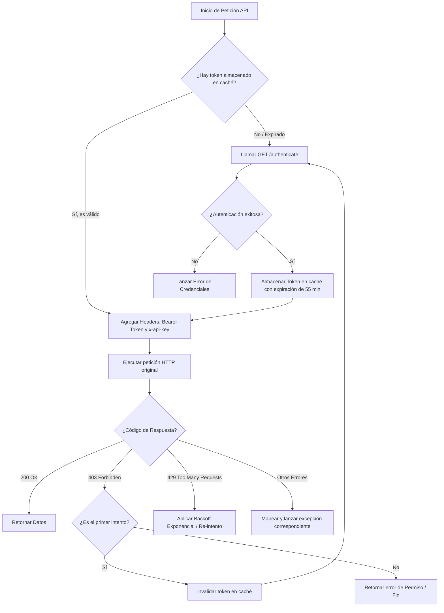

# Wise CX API

## Overview
Wise CX API reference for managing case routing, agent presence, calls, and email activities.

## Formato y Autenticación
- **Base URL:** `https://api.wcx.cloud`
- **Límite de peticiones (Rate Limit):** 5000 requests/min, 150000 requests/day.
- **Autenticación (GET /core/v1/authenticate):**
  - Requiere parámetro query `user` y cabecera `x-api-key`.
  - Retorna Token JWT válido por 3600 segundos.
  - Peticiones posteriores: cabecera `Authorization: Bearer <Token>`.

### Generación del API Key
1. Acceder a **Settings** -> **Canales** -> **Api** en Wise CX.
2. Registrar un nombre de usuario (`user`).
3. Presionar **Generar** para obtener la `x-api-key`.

### Reglas Críticas
- Enviar cabecera `x-api-key` y `Authorization: Bearer <Token>` en **todas** las peticiones subsiguientes.
- Si se omite `x-api-key` tras autenticar, la API retornará `403 Forbidden`.

## Endpoints y Parámetros

### 1. Crear Casos (Llamadas / Correos)
- **POST** `/core/v1/cases`
- **Parámetros del Body (JSON):**
  - `source_channel` (string, requerido): `"phone"` para llamadas, `"email"` para correos.
  - `group_id` (string, requerido): ID de la cola asignada.
  - `subject` (string, requerido): Asunto del caso.
  - `activities` (array, opcional): Actividades iniciales asociadas.

### 2. Login y Asignación de Agentes a Colas
- **PUT** `/core/v1/users/{id}/queues`
- **Parámetros del Body (JSON):**
  - Array de objetos conteniendo:
    - `id` (string, requerido): ID de la cola.
    - `auto_assign` (boolean, requerido): `true` para activar enrutamiento automático (estar disponible).

### 3. Consultar Estado de Operación
- **GET** `/core/v1/business_hours/is_open`
- **Parámetros Query (Opcionales):**
  - `queue_id` (string): Evalúa si una cola específica está en horario de atención.

## Pruebas de Conexión (Testing / Ping)

### Fase 1: Ping de Autenticación
Comprobar credenciales con `GET https://api.wcx.cloud/core/v1/authenticate?user=test_user` y el header `x-api-key`.
- **200 OK:** Credenciales válidas.
- **403/401:** Credenciales inválidas.

### Fase 2: Ping de Consumo
Validar token JWT obtenido consultando `GET https://api.wcx.cloud/core/v1/channels?limit=1`.
- Debe llevar headers `Authorization` y `x-api-key`.

## Arquitectura del Cliente HTTP (WiseCxClient)



## Recomendaciones de Optimización y Errores
- **Caché del Token:** Almacenar token en memoria/Redis con TTL de **55 minutos** (margen de 5m antes del vencimiento).
- **Mapeo de Errores HTTP:**

| Código HTTP | Causa Probable | Acción Recomendada |
| :--- | :--- | :--- |
| **400 Bad Request** | Parámetros inválidos o filtros erróneos. | No reintentar. Corregir formato. |
| **403 Forbidden** | Falta `x-api-key` o token expiró. | Limpiar caché de token, re-autenticar y reintentar una vez. |
| **429 Too Many Requests**| Superado rate limit (5000/min o 150000/día). | Aplicar **Backoff Exponencial con Jitter**. |
| **500 / 503 Server Error**| Caída de Wise CX. | Reintentar con retraso prudente (ej. 2s, 4s, 8s). |

> [!IMPORTANT]
> En caso de dudas sobre endpoints adicionales o cambios en los esquemas, consultar la documentacion oficial en https://api-docs.wisecx.com/ y hacer preguntas pertinentes.

---

## Implementacion en el proyecto

**Cliente:** `src/lib/wise-cx-client.ts`
- Exporta: `wiseCxGet`, `wiseCxPost`, `wiseCxPut`, `wiseCxDelete`
- Auth JWT con cache en memoria (55 min TTL)
- Auto-reautenticacion en 403
- Retorna `InvgateResult<T>` (mismo patron que InvGate)

**Variables de entorno (`.env`):**
```
WISE_CX_BASE_URL="https://api.wcx.cloud"
WISE_CX_API_KEY="<key>"
WISE_CX_API_USER="<user>"
```

**Endpoint de estado:** `GET /api/admin/wise-cx-status`
- Verifica conexion autenticando + consultando `/core/v1/channels?limit=1`
- Tarjeta en `/admin`: `src/components/ui/AdminWiseCxStatusCard.astro`

**Uso:**
```typescript
import { wiseCxGet } from "@/lib/wise-cx-client";
const result = await wiseCxGet<MyType>("/core/v1/endpoint");
if (result.ok) { /* result.data */ }
```
