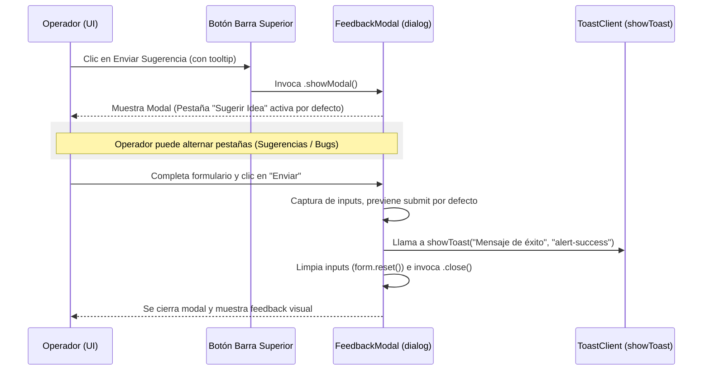

# Diseño: Formulario de Sugerencias y Reporte de Bugs en Barra Superior

Fecha: 2026-06-25
Estado: Propuesto

## 1. Contexto y Objetivos

El portal de la Mesa de Ayuda Interna requiere habilitar un canal rápido para que los operadores N1/N2 puedan enviar sugerencias de mejora o reportar errores (bugs) sin interrumpir su flujo operativo actual.

La solución integrará un botón interactivo en la barra superior (Header) que abrirá un modal unificado. Este modal dividirá ambas necesidades (Sugerencias / Reportes de Bugs) utilizando pestañas, resolviendo así el requisito de mantener la opción de reportar bugs dentro del flujo de sugerencias y no suelto en la barra superior.

## 2. Decisiones de Diseño e Interfaz (UI/UX)

Siguiendo las reglas de estilo de `DESIGN.md` y `frontend.md`:
*   **Mobile-First:** El modal se adaptará como una hoja deslizable desde abajo en dispositivos móviles (`modal-bottom`) y se centrará en pantallas medianas o grandes (`sm:modal-middle`).
*   **Consistencia de Color:** Utilizaremos únicamente los tokens semánticos del tema de DaisyUI (`primary`, `secondary`, `accent`, `base-*`). No se usarán clases con valores de color hardcodeados.
*   **Identificación del Usuario:** El formulario extraerá automáticamente la identidad del usuario logueado en la sesión a través de `Astro.locals.user`, evitando pedir Nombre/Legajo o Correo manualmente en el formulario.

### Estructura de Campos

1.  **Pestaña A: Sugerir Idea**
    *   *Asunto:* Input de texto corto (`Asunto o título de la sugerencia`).
    *   *Área / Categoría:* Menú desplegable (`General`, `Inventario`, `Mesa de Ayuda`, `Cubics`, `Directorio`, `Otros`).
    *   *Descripción:* Textarea descriptivo para la propuesta.

2.  **Pestaña B: Reportar Bug**
    *   *Asunto:* Input de texto corto (`Ej: Error al exportar listado`).
    *   *Gravedad:* Menú desplegable (`Leve (Visual)`, `Moderado (Funcionalidad afectada con alternativa)`, `Crítico (Fallo bloqueante)`).
    *   *Descripción del error:* Textarea con detalles de lo ocurrido.
    *   *Pasos para reproducir:* Textarea ordenado con los pasos para evidenciar el bug.

## 3. Propuesta de Arquitectura

Se propone crear un componente Astro autocontenido para el modal, evitando la dispersión de marcado y lógica dentro del layout principal:

*   **Nuevo Componente:** [FeedbackModal.astro](file:///d:/correo-argentino-mda/src/components/ui/FeedbackModal.astro)
    *   Contiene el elemento `<dialog id="feedback_modal" class="modal">` de DaisyUI.
    *   Implementa las pestañas y el intercambio visible de los formularios con clases CSS nativas (`hidden`).
    *   Realiza la llamada al cliente `showToast` tras procesar localmente el formulario sin redirección.
*   **Modificación en Layout:** [BaseLayout.astro](file:///d:/correo-argentino-mda/src/layouts/BaseLayout.astro)
    *   Importación de `<FeedbackModal />` al final del documento.
    *   Habilitación del botón "Enviar sugerencia" de la barra superior.
    *   Asociación de atributos `data-` para enlazar los eventos de apertura del modal.

## 4. Flujo de Interacción e Integración de Código

## 5. Plan de Verificación

### Pruebas Manuales
1.  **Apertura y Cierre:**
    *   Hacer clic en el botón del Header "Enviar sugerencia" -> Debe abrirse el modal.
    *   Hacer clic en el botón "Cancelar" o el ícono de cerrar `X` -> Debe cerrarse el modal.
    *   Hacer clic en el fondo oscuro (backdrop) -> Debe cerrarse el modal.
2.  **Alternancia de Pestañas:**
    *   Hacer clic en "Reportar Bug" -> Debe cambiar el formulario activo y resaltar la pestaña correspondiente.
    *   Hacer clic de vuelta en "Sugerir Idea" -> Debe restaurar el formulario de sugerencias.
3.  **Envío y Validación:**
    *   Intentar enviar campos requeridos vacíos -> El navegador debe alertar del campo obligatorio.
    *   Completar campos y presionar "Enviar" en Sugerencias -> Debe cerrarse el modal, mostrar un toast verde con el mensaje de éxito, y al volver a abrir el modal, los campos deben estar limpios.
    *   Completar campos y presionar "Enviar" en Reportar Bug -> Debe cerrarse el modal, mostrar el toast verde y limpiar los campos de bugs.
