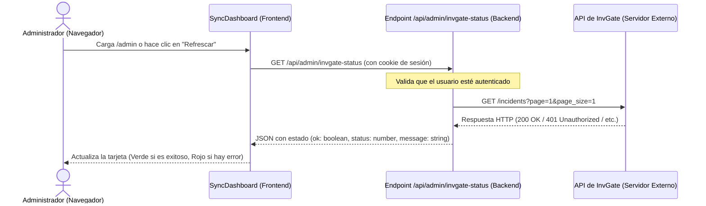

# Spec: InvGate Admin Diagnostic Card

Este documento especifica el diseño y la arquitectura para integrar el estado de conexión de la API de InvGate en el panel de administración del sistema.

---

## 1. Arquitectura y Flujo de Datos

El diagnóstico se realiza bajo demanda desde el navegador del operador mediante una llamada HTTP asíncrona a un endpoint específico del servidor:



---

## 2. Cambios de Backend

### Nuevo Endpoint: `src/pages/api/admin/invgate-status.ts`
Se creará una ruta API protegida para evitar la exposición pública de la integración:
- **Protección**: Verifica que `locals.user` exista y sea válido.
- **Acción**: Ejecuta `invgateGet("incidents?page=1&page_size=1")` para testear las credenciales contra un endpoint ligero de InvGate.
- **Respuesta**:
  - `401 Unauthorized` si el usuario no tiene sesión activa.
  - `200 OK` con un JSON estructurado que encapsula el resultado:
    ```typescript
    {
      "ok": boolean,
      "status": number,
      "message": string
    }
    ```

---

## 3. Cambios de Frontend

### Modificación del Componente: `src/components/admin/SyncDashboard.astro`

1. **Diseño de la Card**: Se agregará una tarjeta con la estructura semántica compatible con DaisyUI.
   - El grid del contenedor cambiará de `grid-cols-1 md:grid-cols-2` a `grid-cols-1 sm:grid-cols-2 lg:grid-cols-3 gap-4` para acomodar tres tarjetas de manera responsiva.
   - La nueva tarjeta constará de:
     - Un bloque de texto: Título ("Integración InvGate"), Estado de Conexión ("Cargando...", "Conectado", "Error de Conexión"), y un Mensaje Detallado.
     - Un bloque de acciones con un botón circular sutil de refresco (`btn-ghost btn-circle btn-xs`) con el icono `boxicons:refresh`.
     - Un contenedor de icono que cambia de tono semántico (`bg-success/15` con el icono `boxicons:plug` en verde; o `bg-error/15` con el icono en rojo).

2. **Lógica en el script del cliente**:
   - Se creará una función `updateInvgateStatus()` que haga un fetch a `/api/admin/invgate-status`.
   - Se actualizarán dinámicamente las clases y textos de la tarjeta.
   - Al hacer clic en el botón de refresco, se añadirá la clase `animate-spin` al icono de refrescar para dar feedback visual de que se está realizando la consulta de red, removiéndola al finalizar.
   - La tarjeta iniciará su consulta inmediatamente al cargarse la página (`DOMContentLoaded` / `astro:page-load`) de forma aislada, y no formará parte del pooling automático de 30 segundos de las tarjetas de sincronización de datos locales, optimizando los recursos y evitando rate-limiting.

---

## 4. Plan de Verificación

- **Estática**: Comprobar tipos en todo el proyecto con `npx astro check`.
- **Integración**:
  - Ingresar a la sección `/admin` con un rol de administrador y verificar la carga inicial automática.
  - Confirmar el mensaje detallado devuelto en caso de credenciales correctas o inválidas.
  - Hacer clic en el botón de refrescar y observar la animación y la actualización del estado.
  - Probar a ingresar desautenticado (o con un usuario sin sesión) y verificar que el backend responde con un 401 y la tarjeta muestra el error sin filtrar información sensible del servidor.
